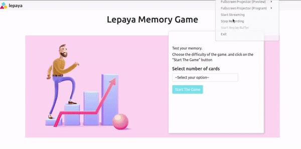

<h1 align="center">Memory Game</h1>

### ✨ [Demo](https://m-g2.herokuapp.com/)

<p align="center"></p>

This app created using HTML, CSS, and Js.

## Install

```sh
git clone git@github.com:Rezan92/memory-game.git
cd memory-game
npm install
```
## Running the App

1. Make sure that you are in the **memory-game** folder
2. In your Terminal run ```npm run server```.
3. Navigate to [http://localhost:5000/](http://localhost:5000/) in your browser.

## Author

👤 **Rezan Al Ibrahim**

- Github: [@Rezan](https://github.com/rezan92)
- Linkedin: [@Rezan](https://www.linkedin.com/in/rezan-alibrahim)
